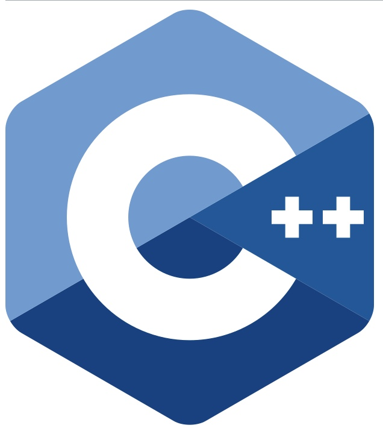
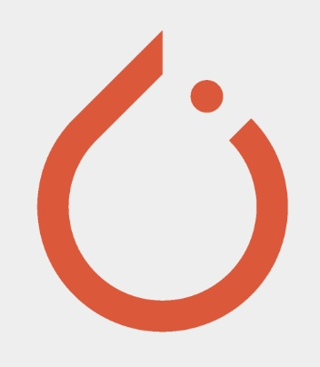
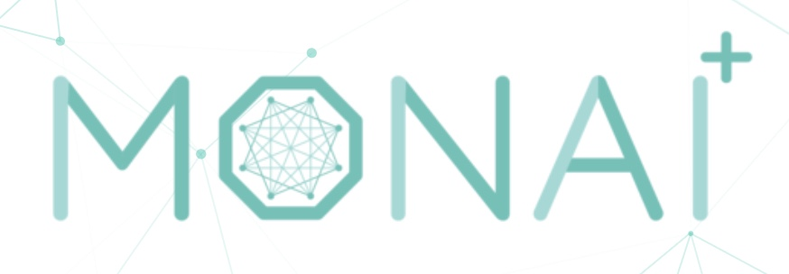

  
  <!-- Used the following command to reshape the gif while preserving animation:
       ffmpeg -i assets/gianni-wave.gif -vf scale=960:-1 assets/gianni-wave-wide.gif -->

# Hello there, I'm Gianni 👋

  

 
&nbsp;
&nbsp;

I'm a computer science student and aspiring machine learning engineer based in Heidelberg, Germany. My main focus is on developing and applying machine learning methods, from deep learning to modern generative AI, while also exploring their real‑world applications.

<table width="100%">
  <tr>
    <td style="vertical-align:top;">
      <h2>About me</h2>
      <ul>
        <li>🔭 I'm currently working on several interesting projects and enjoy collaborating with others.</li>
        <li>🌱 I'm always learning and experimenting with new tools and languages.</li>
        <li>💬 Feel free to ask me anything or reach out for a chat.</li>
        <li>📫 You can connect with me on <a href="https://www.linkedin.com/in/giannigagliardi/">LinkedIn</a>.</li>
      </ul>
    </td>
    <td align="center" width="240" style="vertical-align:middle;">
      
    </td>
  </tr>
</table>

---

 

### Languages and Tools: 

<!--img align="left" alt="Typescript" width="35px" src="https://w7.pngwing.com/pngs/915/519/png-transparent-typescript-hd-logo-thumbnail.png" />
<!--  -->
<!--  -->
<!--img align="left" alt="JavaScript" width="35px" src="https://raw.githubusercontent.com/github/explore/80688e429a7d4ef2fca1e82350fe8e3517d3494d/topics/javascript/javascript.png" />

<!--  -->
<!--img align="left" alt="GraphQL" width="26px" src="https://raw.githubusercontent.com/github/explore/80688e429a7d4ef2fca1e82350fe8e3517d3494d/topics/graphql/graphql.png" />

<!--  -->

<!--  -->

<!--  -->

<!--  -->
<!--  -->
<!--  -->
<!--  -->

 
 
 
 

